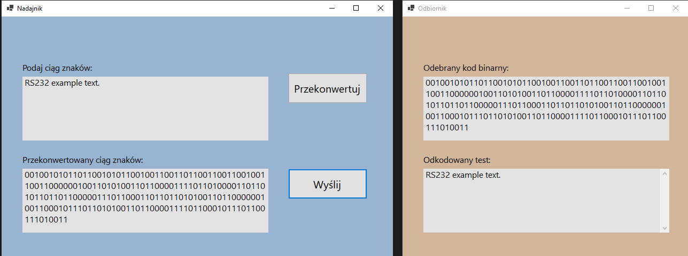

# RS232 Communication Protocol Simulation

## Overview
This project simulates the RS232 communication protocol, a standard for serial communication transmission of data. It provides an educational tool for understanding and demonstrating how data is transmitted and received according to the RS232 standard.

## Features
- **Simulation of Serial Communication:** Emulates the behavior of the RS232 protocol.
- **Interactive Interface:** Allows users to imput text string.
- **Real-time Data Transmission:** Visualizes the data transmission process in real-time.
- **Dictionary of swear words:** Dictionary with the help of which curses are recognized in order to censor them.

## Getting Started

### Prerequisites
Install Visual Studio IDE with .NET 6.0.

### Installation
1. Clone the repository or download the ZIP file.
2. Extract the project files to your local machine.
3. Compile the source files using Visual Studio with .NET 6.0 Framework.
4. Run the executable to start the simulation.

## Project Description

The created application simulates serial transmission compliant with the RS232 standard. In the transmitter window (computer 1), text in the form of ASCII character strings is entered, which is then converted into a bit string (sequence of 1s and 0s) according to the standard. This is then transmitted to the receiver (computer 2), where it is decoded back into text. The received text is filtered for profanities based on a dictionary contained in a txt file included in the program's resources. The letters of any word found in the dictionary are replaced with a sequence of asterisks (one character per asterisk), and such censored text is then displayed on the receiver's screen.
The transmitter and receiver are treated as two separate windows (forms) within the application. The conversion of ASCII characters is performed by transforming each character into a sequence of 0s and 1s, which are appended to the convertedText string. Each bit sequence corresponds to a given ASCII character. Characters are converted into the format:

**bitStart(0) + bitsOfCharacterInReverseOrder + bitStop(1) + bitStop(1)**

In the receiver window, the process is reversed, meaning the bit sequence is converted back into a character string and concatenated into a string form.
The mechanism for filtering profane words is based on reading "obscenities" from a .txt file into a List<string>. Using a foreach loop, each word from the .txt file is added to the list. When a profanity is detected, the process of filtering takes place (the text here is cut off, please provide the continuation if needed).

## Interface Description

The application consists of two windows, the Transmitter window and the Receiver window. In the Transmitter window, there is a field where a string of characters can be entered and then converted into a bit string by clicking the conversion button. The converted string of characters is displayed in the field below. Then, the string can be sent to the Receiver, where the text is received, decoded, and displayed in letter form.

## Authors

Katarzyna Szczerba

Aleksandra Boruczkowska
